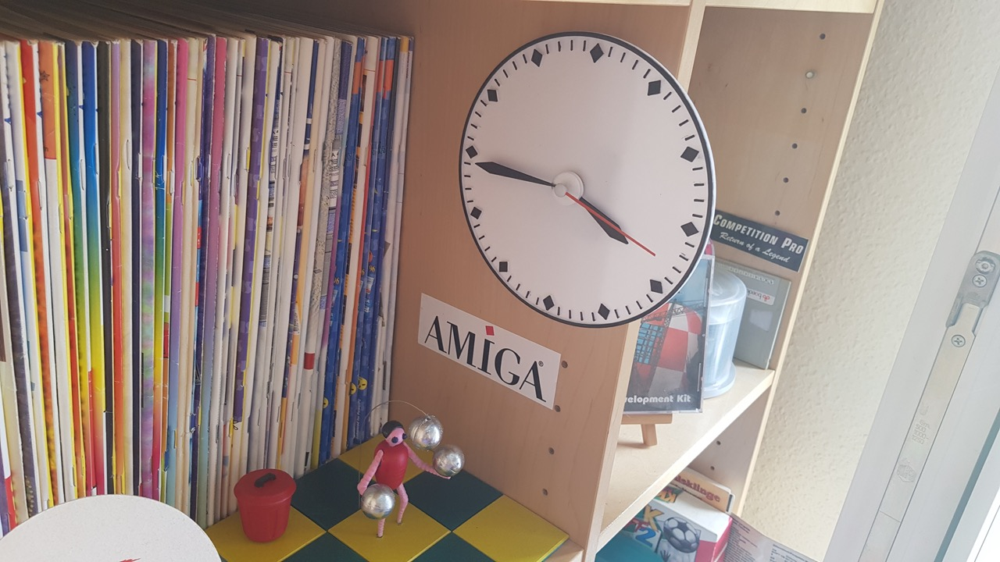

# Amiga Clock (3 June 2021)
by IOIO72 aka Tamio Patrick Honma (https://honma.de)

## Description

Amiga Clock is an adaptation of Clock V2.15 from Amiga Workbench 1.2.

You can attach this 3D print to a clock movement to experience the physical version of an iconic program from the digital past.

The model is customizable and can be adapted to any clockwork and size - down to wristwatches. It's even possible to print static versions of different time settings, i.e. to create opening times signs.

For those, who don't want to create a customized version, here's the clockwork, I used for this project:
https://www.amazon.de/gp/product/B08RNJ5SYK/

### Where's the second hand?

Since the second hand has a small pin for mounting, it is not easy to print one that is accurate enough. The purchasable clockwork packages usually include a variety of hands from which you can choose. There should definitely be a second hand that is just a dash, like the one on the Amiga Clock. Use this second hand and paint it orange.

### Use OpenSCAD

1. **Download and install:** [OpenSCAD](http://openscad.org/) version 2021.01 or newer
2. **Download:** The *.scad file of this model.
3. **Start** OpenSCAD and **open** the *.scad file in it.
4. **Open the customizer** via the menu "Window/Customizer"

Now you can configure the model and use the `F5` key to render the preview of your changes.

#### Export your STL file

If you're done with your model settings, you can export the STL file:

1. Render the mesh by pressing the `F6` key.
2. Wait until the rendering is finished. This might take some minutes.
3. Export the STL file by pressing the `F7` key.

#### Optionally save your configuration

If you like to use your configuration as a template for further models, it's a good idea, to save your configuration:

1. Click the `+` symbol in the customizer, which you find beside the configuration selector drop-down in the second line of the customizer.
2. Give your configuration a name.

Use the drop-down menu to access your saved configurations.

### Trivia

The preset time refers to the time displayed on the Amiga clock icon.
The story behind this time is interesting:
http://theamigamuseum.com/amiga-kickstart-workbench-os/workbench/workbench-1-2/

### Smartwatch

If you want to wear an Amiga wristwatch as a Wear OS, Tizen or Apple Watch watchface, take a look at my WatchMaker creation:
https://getwatchmaker.com/watchface/amiga-wb-1-2

## Customizer

First of all: The customizer provides a test print model. This helps you to test your entered measurements without the need to print the whole model.

### Create a running Clock

If you like to create a running clock, you need to get a clockwork first.

By default the value `fastening_elements` in the `Modify Parts` section is turned on. If it's not, you should turn it on, as this switches on the part modifications to attach all clock part to the clockwork.

To adapt the Amiga Clock to your clockwork, you should use a caliper to measure it and enter the following values into the customizer:

#### Clockwork Hub

The following parameters are the most important ones:

1. In the lower part of the hub there is usually a thread where you screw the nut to fix the dial to the movement. Measure the diameter of the thread and enter the value to `hub_diameter`
2. Directly above the thread should be the wheel for the hour hand. Enter the diameter of this wheel in `hub_hours_diamater`.
3. And above the hour hand wheel should be the wheel for the minute hand. Enter this diameter in `hub_minutes_diamater`
4. On the back of the dial, you can adjust the diameter of an embossed alignment aid. My movement package included a rubber ring that fits in this embossment as a spacer to the movement case. Enter this value in `hub_embossment`.

#### Alignment helpers

To align the clockwork enclosure to the clock face, the enclosure offers four small pins - at least the one I've used. If your one doesn't provide these pins, you can set the value `pin_diameter` to zero.

If you like to use the pins, you should measure the diameter of one pin and enter the value in `pin_diameter`.

As the pin sticks into the backside of the clock face, you should enter the depth of the pin in `pin_depth`.

The positions of the pins should be measured from the center of the hub to each horizontal and vertical positions in the following order in the main brackets of `pin_positions `:

1. the values of the **left top pin** are entered in the the values of the **left top pin** are entered in the first bracket..
2. the values of the **right top pin** are entered in the **second bracket**.
3. the values of the **right bottom pin** are entered in the **third bracket**.
4. the values of the **left bottom pin** are entered in the **fourth bracket**.

#### Test your entered measurements

The accuracy of the entered values not only depend on the measurement itself, but also on the used filament, your slicer settings and the printer setup. Therefore, Amiga Clock provides test parts, which you can print without the need to print the large clock face.

To do this, go to the section `Select Parts` and unselect all parts. Then go to the section `Test Parts` and enable `measurements_test_parts`.

### Design your Clock

The main setting to design your clock, is the diameter of the clock face. Enter the value in `face_diamater`.

Additionally you can change the depth of the clock face in `face_base_depth`.

If you like to print the clock face base apart from the clock face content, which are the minutes lines and hours rhombuses, you can set an emboss depth value in `emboss_depth`. This embosses the content in the clock face base, which helps you to glue the elements accurate onto the clock face base.

#### Change the appearance of the Clock Face Content

You can tweak the depth, border size, content margin, minutes line size and hours rhombus size of the clock face in the section `Clock Face Content`. You can do this to personalize the content design. You need to do this, if you use a very small or large clock face diameter.

#### Configure Clock Hands

You can change the Clock Hands in depth in `hands_depth` . Note, that the minute hand uses half of the depth for the mount ring.

You can set the margin from hours rhombus' to the tip of the minute hand in `hands_margin`.

You can adjust the heights of the hands to affect how thin or wide they appear in `hour_hand_height` and `minute_hand_height`.

If you've activated the `fastening_elements`, both clock hands will provide an attachment ring, which refer to the diameters of the hub settings. To defined the size if this ring, you can change it in `hands_mount_ring_border_size `.

If you like to print a static version of the Amiga Clock, you can change the displayed time in `clock_time_hour` and `clock_time_minute`.

### Export Parts

Depending on your plan, how to attach the parts of the clock together, you can select and combine the parts as you like. Here are the usual combinations:

* If you like to export parts for a **real clockwork**, you have to **enable** `fastening_elements` and select and export the parts in the following combinations:
  * Select **minute hand** only, press F6, wait until render finishes and press F7 to export the STL.
  * Select **hour hand** only, press F6, wait until render finishes and press F7 to export the STL.
  * Select the **clock face base and clock face content together**, press F6, wait until render finishes and press F7 to export the STL.
* If you like to use **white filament** for the clock face base and **black filament** for the clock face content on a single extruder printer, you can export them separately and glue them together.
* If you like to export a **static version** of the clock,  **disable** `fastening_elements`, set your desired time in `clock_time_hour` and `clock_time_minute` and export **all parts together**.

# Mount the Clock

## Use test parts

To verify your measurements and the print settings, use the test parts.

## Attach parts

